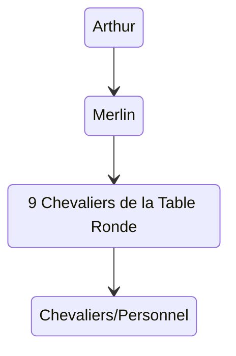

Une des uniques forces de défense face à l'Anathème.

Membres : chevaliers, environ 1000.

Créé par Arthur et Merlin, soutenu par les immortels. 

Merlin et Gauvain : conçoivent les armures.

# Arthur et Merlin
James Niakaté découvre presque par hasard une méta-armure, *Excalibur*,  grâce à Viviane (rumeur). 

Raphaël MacTavish devient le porteur d'*Excalibur*, Arthur, et devient un héros en libérant Dublin seul.

# Fondation du Knight
Ce succès engendre la création de 100 méta-armures en 1 mois.

Ajout d'armes et modules.

Rivalité avec le Nodachi.

# Organisation
Stricte hiérarchie.

Arthur commande, on ne s'adresse à lui que via les Chevaliers de la Table Ronde en temps normal, sauf lors des séances de doléances hebdomadaires.

Juste en dessous : Merlin, conseiller.

Ismaël Jhélam a accès aux réunions car PDG de Byrd.

Quête principale : le Graal.

# Sections et Leaders
## Kay et la section Ogre
**Leader** : Helena MacTavish, demi-soeur d'Arthur, aka Kay. A coordonné à elle seule l'évacuation de Paris. Discrète et pas intéressée par la gloire individuelle. Armure *Fantôme* qui lui permet de rester invisible quand et pour aussi longtemps qu'elle le souhaite. Elle suit quasi toujours ses hommes en mission. 

Taille : 100 personnes.

Section commando de personnages très résistants au désespoir. Opérations dans les ténèbres profondes, avec armures légères et discrètes. Section avec le plus de pertes qui n'attire pas les recrues.

## Gauvain et la section Giant
**Leader** : Gauvain, 20 ans et le plus intelligent des chevaliers de la table ronde. Co-créateur des armures, il a magnifié le concept et induit la diversification des armures. Part souvent en mission pour recherches technos. Ne sort jamais sans son armure *Solar*.

Taille : 1000 personnes, dont 100 chevaliers. 

Section ingénierie et mécanique de Knight.

## Lamorak et la section Gargoyle
**Leader** : Ancien policier de Berlin et rebut, a sauvé Arthur d'une mort certaine. A perdu son bras dans l'opération qui est maintenant une prothèse. Garde du corps du seigneur. Armure *Bastion* extrêmement résistante.

Taille : 50 membres triés sur le volet, très dur d'accès.

Gardes du corps des dirigeants de Camelot, ou ailleurs dans le monde.

## Lancelot et la section Dragon
**Leader** : Diego Omessa, modèle de vertu et héros, recruté pour ses exploits. A vaincu une incarnation de la Bête. Un exemple pour la plupart des agents. Porte son armure prestigieuse *Parangon* et est accompagné de *Flamme*, son faucon. De plus en plus, il aime agir seul.

Taille : 200 membres

Luttent contre le désespoir et les désespérés. Tâches variées et groupe hétéroclite.
## Palomydès et la section Korrigan
La plus belle femme du Knight. Ancienne agente du Monna-Molelo, elle semble savoir tout faire et ne manque pas de le montrer. Volontaire et forte tête. Elle part très rarement en mission, son armure *Sherlock* est quasi toujours remisée à l'atelier.

Taille : 5000 officiellement, 100 en réalité

Soi-disant "fourre-tout" qui abrite un service de renseignement sur la situation mondiale. Palomydès se trouve quasi toujours au siège, l'Oeil.

## Dagonnet et la section Cyclope
**Leader** : Theobald Graafson est un génie des sciences qui vagabonde. Il a découvert l'élement alpha et est le premier à l'expérimenter. Enquête dans les ténèbres : armure *Digger* modifiée pour l'occasion.

Taille : 100 agents

Section spécialisée dans la compréhension des ténèbres, de ses créatures, matériaux et loi. N'importe qui peut consulter leurs informations, à l'inverse de Korrigan.
## Bohort et la section Griffon
**Leader** : Meghan Mac Kenzie, aka Bohort, est une charismatique pilote émérite, remarquablement douée en mécanique. Connue pour sa traque d'une créature mécanique sur le sol américain. Ne sort jamais sans sa moto de combat ni sans *Fu-Mari*, son armure Warrior destinée aux combats à haute vélocité.

Taille : Non mentionnée

Spécialisée dans le convoyage et l'escorte. Pilotes.

## Sagramor et la section Tarasque
**Leader** : Eltius Vendée, aka Sagramor, colosse de plus de 2m10. Sans pitié, préfère anéantir ses ennemis qu'assurer sa propre survie. Personnage controversé dû à son inconscience et le fait qu'il ne tienne pas à ses coéquipiers. Son armure est *Berserk*, conçue pour le corps-à-corps.

Taille : Non mentionnée

Section de la deuxième chance destinée aux renégats, section "suicide" car destinée aux missions quasi impossibles. 

## Bédivère et la section Kraken
**Leader** : Ancien agent du Nodachi, Shinzo Kasugano, aka Bédivère. Trahison du Nodachi (refus de tuer) => fuite et intégration section Ogre. Excellent combattant au CaC et expert en arts martiaux.

Taille : 20 membres
